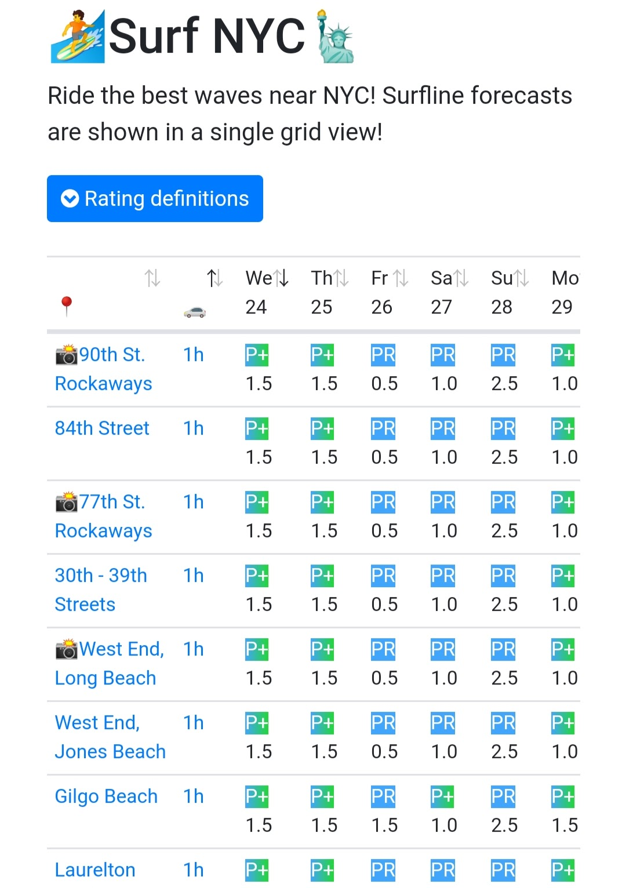

# Go Surf NYC!

Planning a weekend surf trip around NYC? `gosurf` app can help! It shows 
[Surfline](https://www.surfline.com/) 7 day forecasts for all nearby surf 
spots in a single grid view. `gosurf` fetches Surfline's live forecasts 
for all 157 spots that are within 7h drive. 

  

# Architecture

  

`gosurf` uses multiple components to show the best surf spots for surfers. 
`gosurf` runs on AWS Elastic Beanstalk and calls [`surfline-api`](https://github.com/ek-ok/surfline-api)
, which is a separate project runs on AWS Lambda to fetch Surfline 
forecasts for all spots nearby NYC in an asynchronous fashion. Drive time 
from NYC to each surf spot is calculated using Google Map API.  